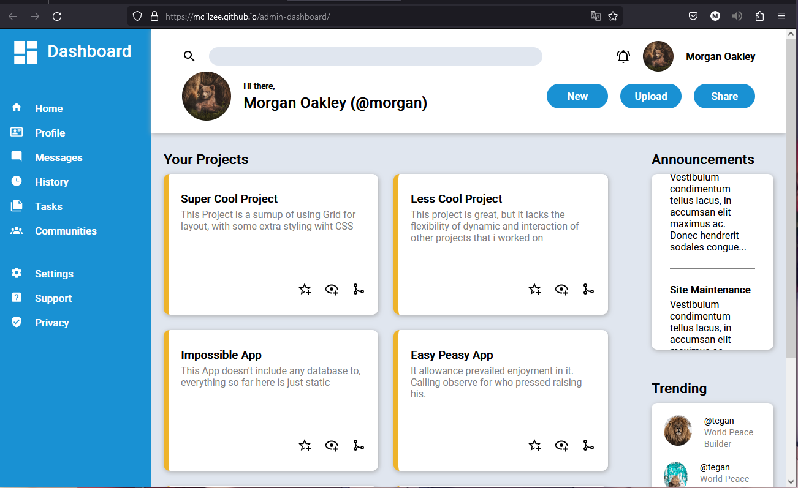

# <a href="https://mclilzee.github.io/admin-dashboard/">Admin dashboard</a>

A showcase of element alighment using grid in CSS. This webpage is just a simple example with no functionality, for the front-end design.
Check out the full page by clicking on the title above.

# Example

# Credit
### Cat photo
<a href="https://unsplash.com/@rebaspike?utm_source=unsplash&utm_medium=referral&utm_content=creditCopyText">Reba
Spike</a> on <a href="https://unsplash.com/?utm_source=unsplash&utm_medium=referral&utm_content=creditCopyText">
Unsplash</a>

### Wolf Photo
<a href="https://unsplash.com/@marcojodoin?utm_source=unsplash&utm_medium=referral&utm_content=creditCopyText">
Marc-Olivier Jodoin</a>
on <a href="https://unsplash.com/s/photos/animal?utm_source=unsplash&utm_medium=referral&utm_content=creditCopyText">
Unsplash</a>

### Bear Photo
<a href="https://unsplash.com/@itfeelslikefilm?utm_source=unsplash&utm_medium=referral&utm_content=creditCopyText">
🇸🇮 Janko Ferlič</a>
on <a href="https://unsplash.com/s/photos/animal?utm_source=unsplash&utm_medium=referral&utm_content=creditCopyText">
Unsplash</a>

### Lion Photo
<a href="https://unsplash.com/@mana5280?utm_source=unsplash&utm_medium=referral&utm_content=creditCopyText">
mana5280</a>
on <a href="https://unsplash.com/s/photos/animal?utm_source=unsplash&utm_medium=referral&utm_content=creditCopyText">
Unsplash</a>
